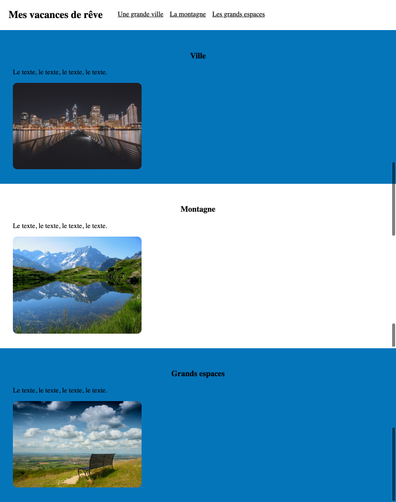

# Session 4 : Ajouter des styles à une page HTML

## Cours

[Cliquer ici pour consulter le cours](https://docs.google.com/presentation/d/1kXFwCMCO097xIDYoTavrTepULkNBk_SBf0L19qyRJ8Y/edit?usp=sharing)

## Documentation

[Cliquer ici pour consulter la documentation CSS sur MDN](https://developer.mozilla.org/fr/docs/Web/CSS/Reference#Index_des_mots-cl%C3%A9s)

## Résultat attendu pour l'exercice

## Exercice

**Rappel : Vérifiez régulièrement l'état de la page dans votre navigateur après chaque modification de code.**

### Partie 1

- Dans l'élément `<head>` de `index.html`, ajouter la balise permettant de relier le fichier CSS "style.css" au document HTML.

### Partie 2

- Écrire une règle pour que l'élément `<body>` ait des marges extérieures (`margin`) de `0` pixel.
- Écrire une règle pour que les éléments `<section>` aient des marges intérieures (`padding`) de `30` pixels.

### Partie 3

- Écrire une règle pour que les éléments `<h3>` soient alignés horizontalement avec le centre du document, voir l'attribut "text-align".
- Écrire les règles suivantes pour l'élément `<h2>` à l'intérieur du `<nav>` :
  - Des marges intérieures égales à `0` pixel.
  - Des marges extérieures égales à `20` pixels.
- Écrire les règles suivantes pour les éléments `<ul>` à l'intérieur du `<nav>` :
  - Des marges intérieures égales à `20` pixels.
  - Des marges extérieures égales à `0` pixel.
  - Enlever les puces sur chaque ligne avec la propriété `list-style`.

### Partie 4

Dans cette partie, nous allons changer le titre `<h2>` et la liste `<ul>` en "conteneurs flexible" pour que leurs enfants soit affichés 
en ligne malgrés leur affichage de type `block`.
(pour en savoir plus sur les flexbox, [cliquez ici](https://developer.mozilla.org/fr/docs/Web/CSS/CSS_Flexible_Box_Layout/Concepts_de_base_flexbox#Le_conteneur_flexible)).

- Écrire une class pour changer l'affichage (`display`) en `flex` et appliquer cette classe 
aux éléments `<nav>` et `<ul>` dans la page html.
- Écrire les règles suivantes pour les éléments `<li>` enfants de l'élément `<nav>`:
  - Écrire une règle pour ajouter une marge extérieure de `15` pixels **à gauche**
  - Écrire une règle pour ajouter une marge intérieure de `20` pixels
- Écrire une règle pour que l'élément `<h2>` enfant de `<nav>` aient une marge intérieure de 15px.

Pour en savoir plus sur la définition de couleurs en CSS, [cliquez ici](https://developer.mozilla.org/fr/docs/Web/CSS/Type_color#Les_couleurs_RGB). 
Essayez de modifier les trois valeurs de `rgb(0, 0, 0)` et constatez les changements dans le navigateur. Remettez la couleur en noir avant de passer à la suite.

- Écrire une règle pour changer la couleur des ancres (éléments `<a>`) en noir (`black` ou `rgb(0, 0, 0)`).

### Partie 5

- Écrire une règle pour que les images aient une largeur égale à `300` pixels.
- Écrire une règle pour que les images aient des coins arrondis de `10` pixels avec la propriété `border-radius`.

### Partie 6

- Écrire une règle pour que les sections titrées "Ville" et "Grands espaces" aient une couleur de fond égale à `rgb(4, 117, 186)`.

### Bonus 1

**Exercice supplémentaire à faire uniquement si vous avez fini les exercices précédents. N'hésitez pas à faire des recherches sur Internet pour vous aider à trouver la solution.**

- Écrire les règles nécessaires pour aligner au centre les paragraphes et les images. Une façon de centrer les images est de les afficher en block:  
	display: block; 
	margin-left: auto; 
	margin-right: auto; 

### Bonus 2

**Exercice supplémentaire à faire uniquement si vous avez fini les exercices précédents. N'hésitez pas à faire des recherches sur Internet pour vous aider à trouver la solution.**

- Écrire les règles nécessaires pour que les ancres dans le `<nav>` changent de couleur et ne soient plus soulignées quand le curseur de la souris passe dessus. Rechercher l'attribut "text-decoration".
